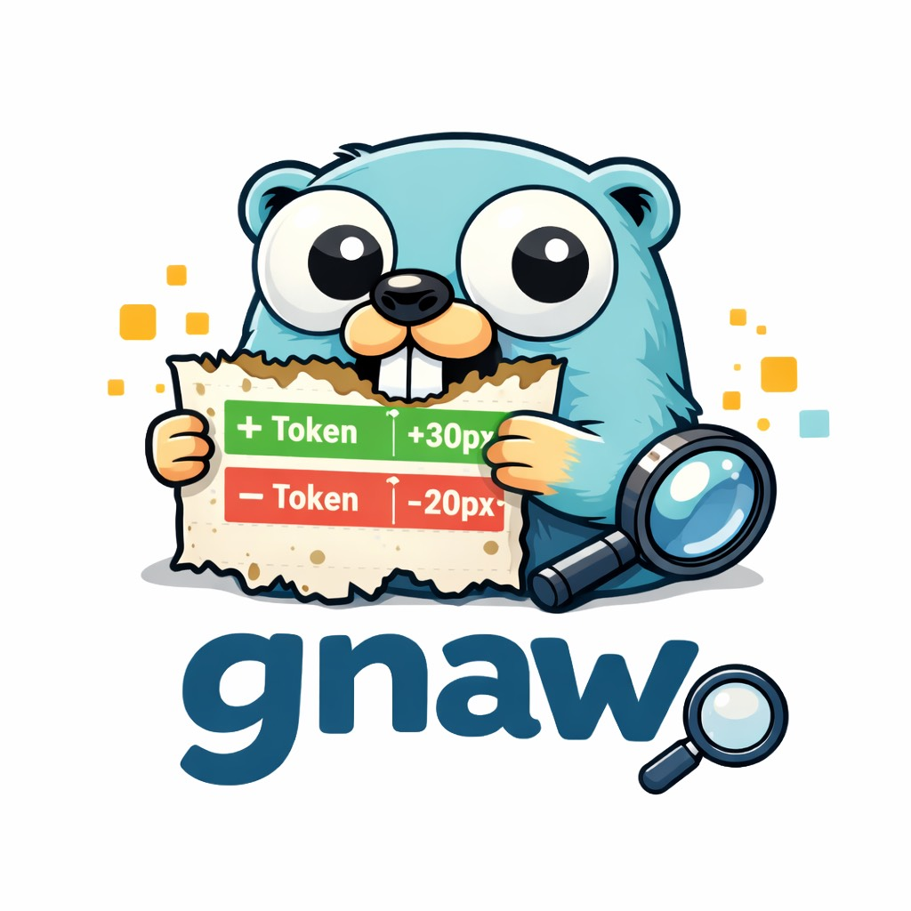

<div align="center">
    
</div>

# Gnaw

[](https://go.dev/)
[](LICENSE)

A CLI tool to snapshot and diff design tokens. Catches token changes before they hit production.

## What it does

Gnaw takes snapshots of your design tokens, commits them to git, and fails your CI if they change unexpectedly.

## Install

```bash
go install github.com/yourusername/gnaw@latest
```

## Usage

```bash
# One-time setup
gnaw init [-name <snapshot file name>] [-tokens <tokens folder path>]

# Generate/update snapshot from token files
gnaw snapshot

# Check if design tokens changed (use in CI)
gnaw diff

# Validate design tokens
gnaw validate
```

## How it works

Gnaw finds all JSON files in your tokens directory, flattens them, and merges into one snapshot.

**Your tokens:**
```
tokens/
├── colors.json
├── typography.json
└── spacing.json
```

**Gets flattened to:**
```json
{
  "colors.primary.500": "#3B82F6",
  "typography.heading.size": "32px",
  "spacing.md": "16px"
}
```

**Saved as:** `tokens.snapshot.json`

When you run `gnaw diff`, it compares current tokens against the snapshot and shows what changed.

## Configuration

After running `gnaw init`, edit `.gnaw` to configure:

```json
{
  "tokensDir": "tokens",
  "snapshotFile": "tokens.snapshot.json"
}
```

---

## Credits

Gopher illustration inspired by the Go gopher, originally created by [Renee French](http://reneefrench.blogspot.com/).

## License

MIT